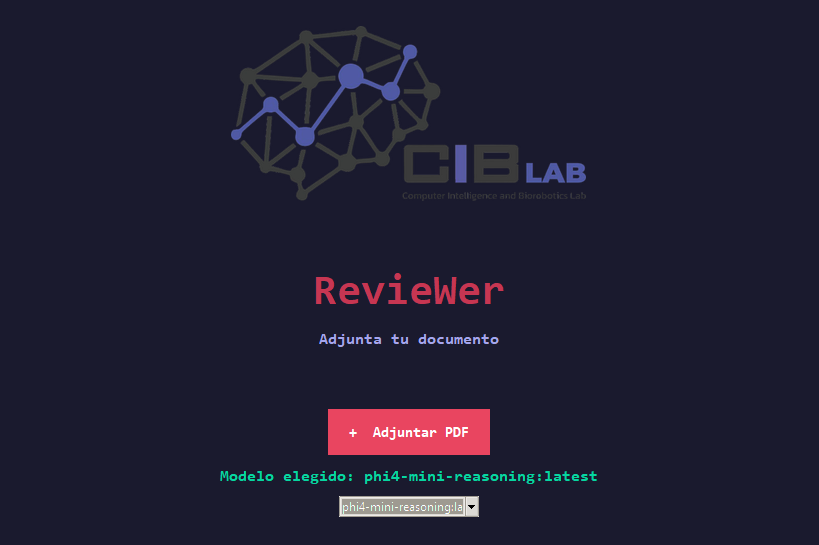

# RevieWer

RevieWer es una herramienta de escritorio para la revisión automática de artículos académicos. Utiliza inteligencia artificial local para analizar documentos PDF, extraer texto y generar informes de revisión detallados.

## Funcionamiento

El sistema procesa documentos en varias etapas:

1. **Extracción de texto**: Convierte PDFs a texto plano utilizando bibliotecas como PyMuPDF.
2. **Análisis con IA**: Emplea modelos de lenguaje local (via Ollama) para evaluar coherencia, metodología, referencias y hallazgos.
3. **Generación de reporte**: Produce un informe en formato Markdown con análisis comparativo y resumen ejecutivo.
4. **Interfaz gráfica**: Una aplicación Tkinter permite subir archivos, seleccionar modelos y visualizar resultados.

## Tutorial

### Instalación
1. Instala Python 3.9-3.14.
2. Instala las dependencias: `pip install -r requirements.txt`.
3. Instala Ollama y descarga un modelo (ej: `ollama pull llama3`).

> En algunas maquinas se requerira estar ejectuando ollama en segundo plano en una terminal con el comando `& "C:\Users\your_user\AppData\Local\Programs\Ollama\ollama.exe" serve ` o la ruta donde este instalado Ollama.

### Uso
1. Ejecuta `python main.py`.
2. Selecciona un modelo de Ollama en la interfaz.
3. Haz clic en "Seleccionar PDF" y elige un archivo.
4. Presiona "Revisar" para iniciar el análisis.
5. Visualiza el reporte generado en la pestaña correspondiente.

## Versiones Legacy

1. [Version Preeliminar (Nougat)](#Nougat_Version)
2. [Version 1.0](#instalación)
3. [Version 1.0 (Joel)](#uso)

### Nougat_Version
La version Nougat es una version previa del revisor donde procesa el texto mediante NOUGAT siendo una herramienta de Meta basada en Deep Learning para escanear a profundidad documentos, esto requiere mucho poder computacional y esta sujeto a errores de extraccion ocasionados por formato y decoraciones en los articulos.

  >Esta version requiere ejecutarse con Python 3.11 e instalar las librerias con las versiones especificadas en el 
`requirements.txt`

### Review_1
Esta es la version que fue disenada para poder extraer texto plano de manera mas eficaz en papers aun no formateados. Esta version es mas ligera a la hora de extraer texto de los documentos antes de pasarlo por los LLMs para su revision.
> Puede ejecutarse en versiones de `python 3.9 - 3.14` siempre y cuando tenga las librerias correspondientes instaladas.

### Reviwer_1 (Joel)